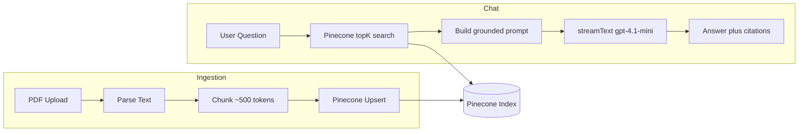

# Doc Chat RAG

Chat with uploaded PDFs using Pinecone integrated retrieval, streamed answers, and numbered citations. Built as a one-day senior portfolio RAG demo.

## Links

- **GitHub:** https://github.com/shawnmcmahon/doc-chat-rag
- **Live demo:** _Set after Vercel deploy — run `vercel --prod` with env vars configured_

## Architecture



## Stack

- **Next.js 16** App Router on Vercel
- **Vercel AI SDK** — streaming chat UI
- **Pinecone** integrated index (`llama-text-embed-v2`, field map `chunk_text`)
- **OpenAI `gpt-4.1-mini`** — grounded synthesis with citations
- **Zod** — env and API validation
- **pdf-parse** — PDF text extraction

## Features

- PDF upload with paragraph-aware chunking (~500 tokens, ~50 overlap)
- Namespace-per-document isolation in Pinecone
- Top-k retrieval with low-score refusal (no LLM call when context is weak)
- Streaming answers with `[1]`, `[2]` citations linked to source panel
- Token usage logging per request
- Eval suite with retrieval hit-rate and answer checks

## Tradeoffs

| Decision | Choice | Why |
|----------|--------|-----|
| Chunking | Fixed-size with paragraph boundaries | Fast to ship; eval-driven tuning beats semantic chunking for day-one |
| Vector store | Pinecone integrated embeddings | Managed speed; no separate embedding API during ingest/query |
| Chat model | `gpt-4.1-mini` | Strong instruction-following for cited RAG vs reasoning models that drift |
| Refusal | Score threshold + prompt | Saves cost; refuses before LLM when retrieval score < 0.03 |

## Cost estimate (~5 users/month)

| Service | Typical cost |
|---------|--------------|
| Pinecone Starter | $0 (within free tier) |
| OpenAI `gpt-4.1-mini` | ~$0.30 (150 questions) |
| Vercel Hobby | $0 |
| **Total** | **~$0–1/mo** |

Per query: ~$0.002 (3.5k input + 400 output tokens). Ingest uses Pinecone embeddings only.

## Setup

1. Clone and install:

```bash
git clone https://github.com/shawnmcmahon/doc-chat-rag.git
cd doc-chat-rag
npm install
```

2. Copy env vars:

```bash
cp .env.example .env.local
```

Fill in `OPENAI_API_KEY`, `PINECONE_API_KEY`, and optionally `PINECONE_INDEX` (default `doc-chat-rag`).

3. Create Pinecone index (first run only):

```bash
npm run setup:pinecone
```

4. Generate sample PDF (optional, already committed):

```bash
npm run generate:sample-pdf
```

5. Start dev server:

```bash
npm run dev
```

## Evals

Run the golden-set eval suite against `eval/sample.pdf`:

```bash
npm run eval
```

Example output:

```
| # | Question                     | Retrieval | Answer | Pass |
|---|------------------------------|-----------|--------|------|
| 1 | What is the refund policy?   | PASS      | PASS   | PASS |
| 2 | When was Acme Docs founded?  | PASS      | PASS   | PASS |
...
```

Cases check retrieval keyword hit-rate, answer content, and off-topic refusal.

## Failure modes handled

- Empty or weak retrieval → fixed refusal without LLM call
- API errors → retry with backoff on Pinecone upsert/search
- Large uploads → 10 MB cap
- Prompt injection in documents → system prompt treats document text as untrusted data

## What I'd do with more time

- Cohere reranker on retrieved chunks
- Hybrid BM25 + vector search
- Query rewriting for conversational follow-ups
- Embedding cache for re-uploaded documents
- Background ingest queue for large PDFs

## Scripts

| Command | Description |
|---------|-------------|
| `npm run dev` | Start Next.js dev server |
| `npm run build` | Production build |
| `npm run setup:pinecone` | Create integrated Pinecone index |
| `npm run generate:sample-pdf` | Regenerate eval sample PDF |
| `npm run eval` | Run RAG eval suite |
